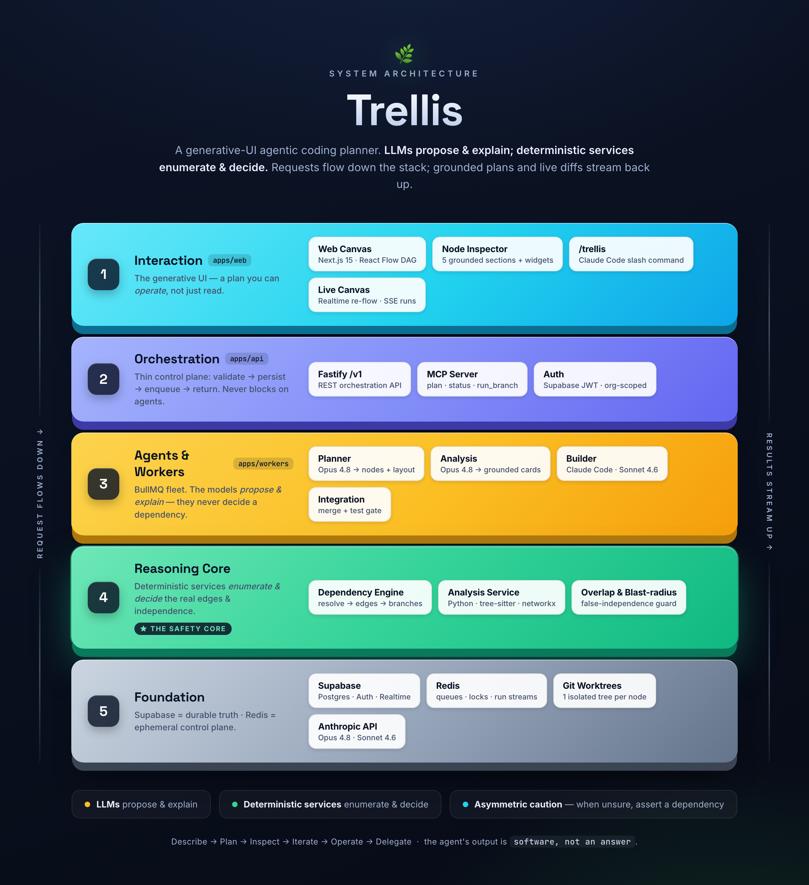
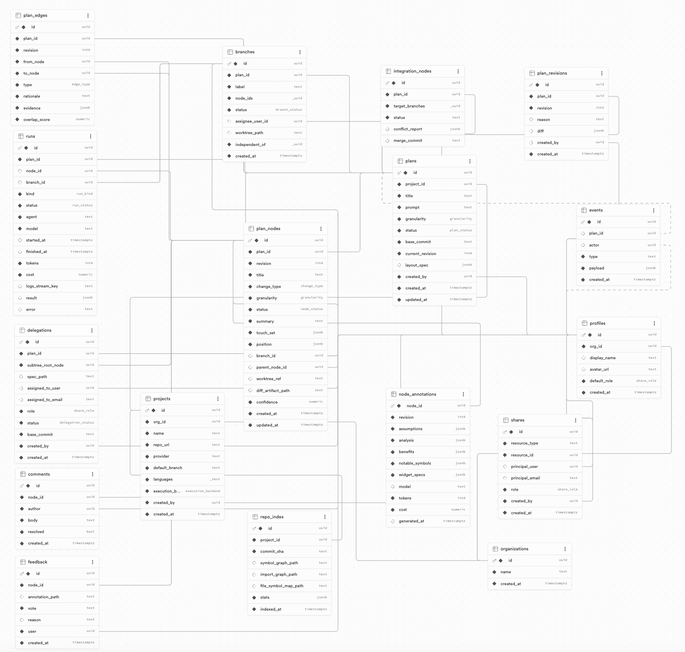

<div align="center">

<sub>🌿</sub>

# Trellis

### **The agent's output is software, not an answer.**

**Trellis is a generative-UI agentic coding planner.** You describe code work at *any* size —
*"tighten this validator"*, *"add OAuth login"*, *"migrate REST → gRPC across the monorepo"* —
and Trellis returns something no chat assistant gives you: **a plan you can operate.** An
interactive dependency graph of the change, where every node carries engineering analysis
grounded in your *real* symbols, independent work is provably safe to run **in parallel**, and a
subtree can be **delegated** to another person or agent.

<br/>


<br/>


<br/>

<!-- TODO[hero]: replace with a real screenshot of the plan-graph canvas (the G2 "OAuth" plan — 6 nodes, 2 tinted lanes, inspector open). A short autoplay GIF of Describe→Plan→Inspect is even better. See docs/SCREENSHOTS.md. -->


<sub><i>The output isn't a chat reply — it's an operable plan graph.</i><!-- TODO: link a hosted demo / recording here --></sub>

</div>

---

## 🌱 What is Trellis?

Every coding assistant today returns a chat reply or a single diff, then builds **linearly**.
Trellis returns a third thing — a **generative, interactive control surface** over a unit of
engineering work that you can inspect, reshape, run, and hand off:

> **Describe → Plan → Inspect → Iterate → Operate → Delegate.**

It's positioned as **"GitHub for plans"**: decompose a request into a dependency graph, fan the
independent pieces out to multiple agents on isolated git worktrees, and reconverge them behind a
test gate — without merge conflicts.

The product rests on **four pillars**:

| | Pillar | What it gives you |
|:--:|--------|-------------------|
| 🕸️ | **Plan Graph (DAG)** | Decomposes intent into a dependency graph of change-nodes and marks the branches that are *provably independent* — and therefore safe to parallelize. |
| 🔬 | **Grounded Analysis** | Every assumption, risk, and benefit cites a real `file#symbol` from your repo — or is flagged low-confidence. No hand-wavy hallucinations. |
| ⚡ | **Parallel Execution & Delegation** | Dispatch independent branches concurrently to a coding agent (Claude Code, headless); diffs stream back live; integration nodes merge behind a test gate. |
| 🎨 | **Context-Adaptive Generative UI** | The canvas layout adapts to the *size* of the work (micro fix → mega migration) and each node renders a widget tuned to its *change type* — always from validated specs, never raw model HTML. |

---

## 🎬 See it in action

> **Describe → Plan → Inspect → Iterate → Operate → Delegate.**
> The whole loop lives in the canvas. Below it runs on the flagship storyline — *"Add Sign in with Google + GitHub"* to an existing login page.

<!--
  TODO[screenshots]: capture the frames referenced below and drop the PNGs into assets/.
  docs/SCREENSHOTS.md lists the exact app state, viewport, and source demo Act for each one.
-->

### 1 · Describe — launch from inside your coding agent


You stay in your coding agent: `/trellis add "Sign in with Google and GitHub" to the login page`. Trellis plans it server-side and hands back a compact summary plus a link — it never tries to draw a graph in your terminal.

### 2 · Plan — a generative dependency graph


The canvas opens on a **compact DAG** — six nodes across **two tinted lanes** that Trellis has proven *independent* (they touch disjoint files), and therefore safe to run in parallel.

### 3 · Inspect — grounded analysis + per-change widgets


Click a node and the inspector opens with a widget tuned to the change type — a **schema-diff** for a migration, an **API-contract** for an endpoint — over five grounded sections. **Every assumption cites a real `file#symbol`** from your repo; hover one and it links straight into the code. Nothing hand-wavy.

### 4 · Iterate — correct it, re-plan live


Reject a weak claim and it greys out — feedback that tunes future analysis. Change the request and the graph **re-plans in place**, no full restart.

### 5 · Operate — dispatch independent branches in parallel


Ratify the plan and Trellis fans the independent lanes out to coding agents on **isolated git worktrees**. Diffs **stream back live**; an integration node reconverges them behind a **test gate** — no merge conflicts.

### 6 · Delegate — hand a subtree to someone else


Hand any subtree to another person or agent. They operate just their slice from their own session, and it reconverges into the same gated merge. *"GitHub for plans."*

---

## 🎨 One UI, four sizes

Trellis picks the layout from the **size** of the work — a one-line fix collapses to a diff; a 50-node migration becomes a zoomable map. Same product, four granularities:

| G1 · micro | G2 · meso | G3 · macro | G4 · mega |
|:--:|:--:|:--:|:--:|
|  |  |  |  |
| *tighten a validator* | *add OAuth login* | *extract a billing module* | *migrate an analytics platform* |

---

## 🧩 Widgets, generated per change type

The node body isn't a wall of text — it's a validated widget chosen for what the change *is*. A few of them:

| | | |
|:--:|:--:|:--:|
|  |  |  |
| **SchemaDiff** · before/after columns | **ApiContract** · method, req/res, breaking flag | **CallGraphImpact** · callers touched |

---

## 🔥 The problem we solve

Engineers — and the agents that assist them — **plan in their heads and execute linearly.**
That breaks down the moment work gets real:

| Today's coding agents | Trellis |
|-----------------------|---------|
| Produce a **linear** plan, then build top-to-bottom | Produces a **dependency graph** that exposes what can run in parallel |
| Dependency reasoning lives in the model's head | A **deterministic engine** decides real edges from your actual symbol graph |
| Claims are plausible but **unverifiable** | Every claim is **grounded in cited symbols** or labelled low-confidence |
| One agent, one thread, sequential | **Fan work out** to many agents/people, reconverge cleanly |
| A wall of chat text, regardless of task size | UI **adapts** to a 1-line fix or a 50-node migration |

The governing principle keeps it trustworthy:

> **LLMs *propose and explain*; deterministic services *enumerate and decide*.**
> The model never has the last word on a dependency.

The planner (an LLM) proposes coarse touch-sets; a pure dependency engine plus a Python analysis
service (tree-sitter + networkx) decide the real edges, overlap, and independence. Trellis errs
on the side of **asymmetric caution** — a false dependency only costs a little parallelism, but a
false *independence* costs a corrupted merge, so when uncertain it asserts a dependency.

---

## 🏗️ Architecture

Trellis is a **pnpm monorepo** of four runtime services over **Supabase Postgres** (durable
truth) and **Redis** (ephemeral control plane). It reads as a five-layer cake — requests flow
*down* the stack, grounded plans and live diffs stream back *up*:

<div align="center">



</div>

| # | Layer | Code | Responsibility |
|:--:|-------|------|----------------|
| **1** | **Interaction** | `apps/web` | The generative UI — a Next.js + React Flow canvas, node inspector with five grounded sections + change-type widgets, the `/trellis` slash command (via MCP), and a live-updating canvas. |
| **2** | **Orchestration** | `apps/api` | A thin Fastify `/v1` control plane: **validate → persist → enqueue → return**. It never blocks on agent work. Includes the MCP server and org-scoped JWT auth. |
| **3** | **Agents & Workers** | `apps/workers` | A BullMQ fleet: **Planner** (Opus 4.8) → nodes + layout, **Analysis** (Opus 4.8) → grounded cards, **Builder** (Claude Code · Sonnet 4.6) → code on isolated worktrees, **Integration** → merge + test gate. |
| **4** | **Reasoning Core** ★ | `engine` + `services/analysis` | **The safety core.** A deterministic dependency engine + a Python (tree-sitter / networkx) service that resolve symbols, compute overlap & blast-radius, and decide which branches are *truly* independent. |
| **5** | **Foundation** | — | **Supabase** Postgres (durable truth: plans, nodes, edges, runs, RLS), **Redis** (queues · locks · live run streams · cache), ephemeral **git worktrees** (one per node), and the **Anthropic** models. |

<sub>The architecture diagram is generated from <a href="docs/architecture.html"><code>docs/architecture.html</code></a> — open it in a browser and screenshot to regenerate <code>assets/architecture.png</code>.</sub>

---

## 🗄️ Data model

The durable source of truth lives in **Supabase Postgres**. Everything hangs off
`organizations → projects → plans`; a **plan** owns its `plan_nodes` (the atoms of work),
`plan_edges` (typed dependencies), `branches` (parallel lanes), `runs` (executions), and
`node_annotations` (the grounded analysis), while `delegations` and `shares` drive collaboration
— with row-level security scoping every row to its org.

<div align="center">



</div>

---

<details>
<summary><b>🚀 Quickstart &amp; repo layout</b></summary>

<br/>

### Monorepo layout

| Path | What |
|------|------|
| `apps/web` | Next.js app — the generative-UI canvas (React Flow), node inspector, change-type widgets |
| `apps/api` | Fastify orchestration REST API (`/v1`) + the `/trellis` MCP launcher server |
| `apps/workers` | BullMQ workers — planner, dependency engine, analysis/annotation agents, the Claude Code build runner, integration |
| `services/analysis` | Python FastAPI dependency-analysis service (tree-sitter + networkx) |
| `packages/shared` | `@trellis/shared` — zod schemas + TS types shared across all TS apps (the contracts) |
| `packages/db` | `@trellis/db` — Supabase Postgres schema/migrations + typed admin client |

### Prerequisites
- Node ≥ 20, pnpm ≥ 9
- Docker (for Redis)
- [Supabase CLI](https://supabase.com/docs/guides/cli) (`supabase`)
- Python ≥ 3.11 + [uv](https://docs.astral.sh/uv/) (for the analysis service)
- [Claude Code](https://docs.claude.com/en/docs/claude-code) on PATH (the build runner)

### Run it
```bash
cp .env.example .env          # fill in keys (see comments in that file)
pnpm install                  # install all TS workspaces
docker compose up -d          # Redis
supabase start                # local Postgres/Auth/Realtime/Storage
pnpm db:migrate               # apply packages/db/migrations
# analysis service:
cd services/analysis && uv sync && uv run uvicorn app.main:app --reload --port 8000
# everything else (web + api + workers):
pnpm dev
```

App: http://localhost:3000 · API: http://localhost:8080 · Analysis: http://localhost:8000

The full product/architecture plan lives in [`plan/`](./plan/README.md); the complete as-built
reference is [`context.mmd`](./context.mmd). Scope is the **MVP** described in `.env.example` and
`plan/00-overview/scope.md`.

</details>
